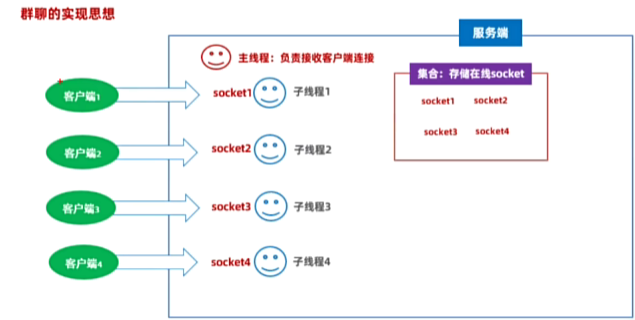

# 《综合项目实战-局域网内的沟通软件》

## 需求：

展示一个用户的登录界面，这个界面只要求用户输入自己聊天的昵称就可以了。

登录进入后，展示一个群聊的窗口，这个窗口要展示在线人数，展示消息展示框，消息输入框，发送按钮，可以实现群聊。实现实时展示在线人数。完全做到即时通讯功能。

## 技术选型

1、GUI 编程技术：Swing

2、网络编程

3、面向对象设计

4、常用 API

## 思路分析

### 1、创建一个模块，代表我们的项目：chat-system

### 2、拿到系统需要的界面：Swing 代码。

- 登录界面：这个界面只要求用户输入自己聊天的昵称就可以了。

```java
package org.example.e_net.i_chat.com.example.ui;

import javax.swing.*;
import java.awt.*;

public class ChatEntryFrame extends JFrame {
    private JTextField nicknameField;
    private JButton enterButton;
    private JButton cancelButton;

    public ChatEntryFrame() {
        setTitle("局域网聊天室");
        setSize(350, 150);
        setDefaultCloseOperation(JFrame.EXIT_ON_CLOSE);
        setLocationRelativeTo(null);
        setResizable(false); // 禁止调整大小

        // 设置背景颜色
        getContentPane().setBackground(Color.decode("#F0F0F0"));

        // 创建主面板并设置布局
        JPanel mainPanel = new JPanel(new BorderLayout());
        mainPanel.setBackground(Color.decode("#F0F0F0"));
        add(mainPanel);

        // 创建顶部面板
        JPanel topPanel = new JPanel(new FlowLayout(FlowLayout.CENTER, 10, 10));
        topPanel.setBackground(Color.decode("#F0F0F0"));

        // 标签和文本框
        JLabel nicknameLabel = new JLabel("昵称：");
        nicknameLabel.setFont(new Font("楷体", Font.BOLD, 16));
        nicknameField = new JTextField(10);
        nicknameField.setFont(new Font("楷体", Font.PLAIN, 16));
        nicknameField.setBorder(BorderFactory.createCompoundBorder(
                BorderFactory.createMatteBorder(1, 1, 1, 1, Color.GRAY),
                BorderFactory.createEmptyBorder(5, 5, 5, 5)
        ));

        topPanel.add(nicknameLabel);
        topPanel.add(nicknameField);
        mainPanel.add(topPanel, BorderLayout.NORTH);

        // 按钮面板
        JPanel buttonPanel = new JPanel(new FlowLayout(FlowLayout.CENTER, 10, 10));
        buttonPanel.setBackground(Color.decode("#F0F0F0"));

        enterButton = new JButton("进入");
        enterButton.setFont(new Font("楷体", Font.BOLD, 16));
        enterButton.setBackground(Color.decode("#007BFF"));
        enterButton.setForeground(Color.WHITE);
        enterButton.setBorderPainted(false);
        enterButton.setFocusPainted(false);

        cancelButton = new JButton("取消");
        cancelButton.setFont(new Font("楷体", Font.BOLD, 16));
        cancelButton.setBackground(Color.decode("#DC3545"));
        cancelButton.setForeground(Color.WHITE);
        cancelButton.setBorderPainted(false);
        cancelButton.setFocusPainted(false);

        buttonPanel.add(enterButton);
        buttonPanel.add(cancelButton);
        mainPanel.add(buttonPanel, BorderLayout.SOUTH);

        // 添加监听器
        enterButton.addActionListener(e -> {
            String nickname = nicknameField.getText();
            if (!nickname.isEmpty()) {
                // 进入聊天空逻辑
                dispose(); // 关闭窗口
            } else {
                JOptionPane.showMessageDialog(this, "请输入昵称！");
            }
        });

        cancelButton.addActionListener(e -> System.exit(0));

        setVisible(true);
    }

    public static void main(String[] args) {
        new ChatEntryFrame();
    }
}
```

- 获取系统需要的聊天界面

```java
package org.example.e_net.i_chat.com.example.ui;

import javax.swing.*;
import java.awt.*;
import java.awt.event.ActionEvent;
import java.awt.event.ActionListener;

public class ClientChatFrame extends JFrame {
    public JTextArea smsContent = new JTextArea(23, 50);
    private JTextArea smsSend = new JTextArea(4, 40);
    public JList<String> onLineUsers = new JList<>();
    private JButton sendBn = new JButton("发送");

    public ClientChatFrame() {
        initView();
        this.setVisible(true);
    }

    private void initView() {
        this.setSize(700, 600);
        this.setLayout(new BorderLayout());
        this.setDefaultCloseOperation(JFrame.EXIT_ON_CLOSE); // 关闭窗口，退出程序
        this.setLocationRelativeTo(null); // 窗口居中

        // 设置窗口背景色
        this.getContentPane().setBackground(new Color(0xf0, 0xf0, 0xf0));

        // 设置字体
        Font font = new Font("Simkai", Font.PLAIN, 14);

        // 消息内容框
        smsContent.setFont(font);
        smsContent.setBackground(new Color(0xf0, 0xf0, 0xf0));
        smsContent.setEnabled(false);

        // 发送消息框
        smsSend.setFont(font);
        smsSend.setWrapStyleWord(true);
        smsSend.setLineWrap(true);

        // 在线用户列表
        onLineUsers.setFont(font);
        onLineUsers.setFixedCellWidth(120);
        onLineUsers.setVisibleRowCount(13);

        // 创建底部面板
        JPanel bottomPanel = new JPanel(new BorderLayout());
        bottomPanel.setBackground(new Color(0xf0, 0xf0, 0xf0));

        // 消息输入框
        JScrollPane smsSendScrollPane = new JScrollPane(smsSend);
        smsSendScrollPane.setBorder(BorderFactory.createEmptyBorder());
        smsSendScrollPane.setPreferredSize(new Dimension(500, 50));

        // 发送按钮
        sendBn.setFont(font);
        sendBn.setBackground(Color.decode("#009688"));
        sendBn.setForeground(Color.WHITE);

        // 按钮面板
        JPanel btns = new JPanel(new FlowLayout(FlowLayout.LEFT, 5, 5));
        btns.setBackground(new Color(0xf0, 0xf0, 0xf0));
        btns.add(sendBn);

        // 添加组件
        bottomPanel.add(smsSendScrollPane, BorderLayout.CENTER);
        bottomPanel.add(btns, BorderLayout.EAST);

        // 用户列表面板
        JScrollPane userListScrollPane = new JScrollPane(onLineUsers);
        userListScrollPane.setBorder(BorderFactory.createEmptyBorder());
        userListScrollPane.setPreferredSize(new Dimension(120, 500));

        // 中心消息面板
        JScrollPane smsContentScrollPane = new JScrollPane(smsContent);
        smsContentScrollPane.setBorder(BorderFactory.createEmptyBorder());

        // 添加所有组件
        this.add(smsContentScrollPane, BorderLayout.CENTER);
        this.add(bottomPanel, BorderLayout.SOUTH);
        this.add(userListScrollPane, BorderLayout.EAST);
    }

    public static void main(String[] args) {
        new ClientChatFrame();
    }
}
```

### 3、定义一个 App 启动类：创建进入界面对象并展示

### 4、分析系统的整体架构



1、开发服务端要做的事情大概有这些：

- 接收客户端的管道链接。
- 接收登录消息，接收昵称信息。
- 服务端也可能是接收客户端发送过来的群聊消息。
- 服务端存储全部在线的socket管道，以便到时候知道哪些客户端在线，以便为这些客户端转发消息。
- 如果服务端收到了登录消息，接收昵称，然后更新所有客户端的在线人数列表。
- 如果服务端收到了群聊消息，需要接收这个人的消息，再转发给所有客户端展示这个消息。

2、客户端界面已经准备好了。

### 5、先开发完整的服务端。

- 第一步：创建一个服务端的项目：chat-server
- 第二步：创建一个服务端启动类，启动服务器等待客户端的连接

```java
public class Server {
  public static void main(String[] args) {
    System.out.println("========= 启动服务端系统 =========");
    try {
      // 1、注册端口
      ServerSocket serverSocket = new ServerSocket(Constant.PORT);
      // 2、主线程负责接收客户端的连接请求
      while (true) {
        // 调用 accept 方法，获取客户端的 Socket 对象
        System.out.println("========= 等待客户端的连接…… =========");
        Socket socket = serverSocket.accept();
        System.out.println("========= 一个客户端连接成功…… =========");
      }
    } catch (Exception e) {
      e.printStackTrace();
    }
  }
}
```

- 第三步：把这个管道交给一个独立的线程来处理，以便支持很多客户端可以同时进来通信。

```java
public class Server {
  public static void main(String[] args) {
    System.out.println("========= 启动服务端系统 =========");
    try {
      // 1、注册端口
      ServerSocket serverSocket = new ServerSocket(Constant.PORT);
      // 2、主线程负责接收客户端的连接请求
      while (true) {
        // 调用 accept 方法，获取客户端的 Socket 对象
        System.out.println("========= 等待客户端的连接…… =========");

        Socket socket = serverSocket.accept();
        new ServerReaderThread(socket).start();

        System.out.println("========= 一个客户端连接成功…… =========");
      }
    } catch (Exception e) {
      e.printStackTrace();
    }
  }
}
```

- 第四步：定义一个集合容器存储所有登录进来的客户端管道，以便将来群发消息给他们。
  - 这个集合只需要一个记住所有的在线的客户端socket

```java
// 定义一个 Map 集合，键是客户端的管道，值是这个管道的用户名称。
public static final Map<Socket, String> onLineSockets = new HashMap<>();
```

- **第五步、服务端线程开始接收登录消息/群聊消息**

> 接收的消息可以有很多种类型：1、登录消息（包含昵称）；2、群聊消息；3、私聊消息；
> 比如客户端先发1，代表接下来是登录消息。
> 比如客户端先发2，代表接下来是群聊消息。

先接收一个整数，再判断，再区别对待

```java
public class ServerReaderThread extends Thread {
    private Socket socket;

    public ServerReaderThread(Socket socket) {
        this.socket = socket;
    }

    @Override
    public void run() {
        try {
            // 接收的消息可以有很多种类型：1、登录消息（包含昵称）；2、群聊消息；3、私聊消息；
            // 所以客户端必须声明协议发送消息
            // 比如客户端先发1，代表接下来是登录消息。
            // 比如客户端先发2，代表接下来是群聊消息。
            // 先从 socket 管道中接收客户端发送来的消息类型编号
            DataInputStream dis = new DataInputStream(socket.getInputStream());
            int type = dis.readInt();
            switch (type) {
                case 1:
                    // 客户端发来了登录消息，接下来接收你能数据，再更新全部在线客户端的在线人数列表。
                    break;
                case 2:
                    // 客户端发来了群聊消息，接下来要接收群聊的消息内容，再把群聊消息转发给全部在线客户端。
                    break;
                case 3:
                    // 客户端发来了私聊消息，接下来要接收私聊消息内容，再把私聊消息发送给指定客户端。
                    break;
            }
        } catch (Exception e) {
            System.out.println("客户端下线了：" + socket.getInetAddress().getHostAddress());
        }
    }
}
```

- **第六步、实现服务端的登录消息接收**

```java
package org.example.e_net.j_chat_server.com.example;

import java.io.DataInputStream;
import java.io.DataOutputStream;
import java.io.IOException;
import java.io.InputStream;
import java.net.Socket;
import java.util.Collection;

public class ServerReaderThread extends Thread {
    private Socket socket;

    public ServerReaderThread(Socket socket) {
        this.socket = socket;
    }

    @Override
    public void run() {
        try {
            // 接收的消息可以有很多种类型：1、登录消息（包含昵称）；2、群聊消息；3、私聊消息；
            // 所以客户端必须声明协议发送消息
            // 比如客户端先发1，代表接下来是登录消息。
            // 比如客户端先发2，代表接下来是群聊消息。
            // 先从 socket 管道中接收客户端发送来的消息类型编号
            DataInputStream dis = new DataInputStream(socket.getInputStream());
            int type = dis.readInt(); // 1、2、3
            switch (type) {
                case 1:
                    // 客户端发来了登录消息，接下来接收你能数据，再更新全部在线客户端的在线人数列表。
                    String nickname = dis.readUTF();
                    // 把这个登录的客户端 socket 存储到在线集合
                    Server.onLineSockets.put(socket, nickname);
                    // 更新全部客户端的在线人数列表。
                    updateClientOnLineList();
                    break;
                case 2:
                    // 客户端发来了群聊消息，接下来要接收群聊的消息内容，再把群聊消息转发给全部在线客户端。
                    break;
                case 3:
                    // 客户端发来了私聊消息，接下来要接收私聊消息内容，再把私聊消息发送给指定客户端。
                    break;
            }
        } catch (Exception e) {
            System.out.println("客户端下线了：" + socket.getInetAddress().getHostAddress());
            Server.onLineSockets.remove(socket); // 把下线的客户端 socket 从在线集合中移除。
        }
    }

    private void updateClientOnLineList() {
        // 更新全部客户端的在线人数列表
        // 拿到全部在线客户端的用户名称，把这些名称转发给全部在线 socket 管道。
        // 1、拿到当前全部在线用户昵称
        Collection<String> onLineUsers = Server.onLineSockets.values();
        // 2、把这个集合中的所有用户都推送给全部客户端socket管道。
        for (Socket socket : Server.onLineSockets.keySet()) {
            try {
                // 3、把集合中的所有用户名称，通过 socket 管道发送给客户端
                DataOutputStream dos = new DataOutputStream(socket.getOutputStream());
                dos.writeInt(1); // 1 代表告诉客户端接下来在是在线人数列表消息 2 代表发的是群聊消息
                dos.writeInt(onLineUsers.size()); // 告诉客户端，接下来要发多少个用户名称
                for (String onLineUser : onLineUsers) {
                    dos.writeUTF(onLineUser);
                }
                dos.flush();
            } catch (Exception e) {
                e.printStackTrace();
            }
        }
    }
}

```

- **第七步：接收客户端的群聊消息**

线程每收到一个客户端的群聊消息，就应该把这个消息转发给全部在线的客户端对应的 socket 管道。

```java
package org.example.e_net.j_chat_server.com.example;

import java.io.DataInputStream;
import java.io.DataOutputStream;
import java.io.IOException;
import java.io.InputStream;
import java.net.Socket;
import java.time.LocalDateTime;
import java.time.format.DateTimeFormatter;
import java.util.Collection;

public class ServerReaderThread extends Thread {
    private Socket socket;

    public ServerReaderThread(Socket socket) {
        this.socket = socket;
    }

    @Override
    public void run() {
        try {
            // 接收的消息可以有很多种类型：1、登录消息（包含昵称）；2、群聊消息；3、私聊消息；
            // 所以客户端必须声明协议发送消息
            // 比如客户端先发1，代表接下来是登录消息。
            // 比如客户端先发2，代表接下来是群聊消息。
            // 先从 socket 管道中接收客户端发送来的消息类型编号
            DataInputStream dis = new DataInputStream(socket.getInputStream());
            while (true) {
                int type = dis.readInt(); // 1、2、3
                switch (type) {
                    case 1:
                        // 客户端发来了登录消息，接下来接收你能数据，再更新全部在线客户端的在线人数列表。
                        String nickname = dis.readUTF();
                        // 把这个登录的客户端 socket 存储到在线集合
                        Server.onLineSockets.put(socket, nickname);
                        // 更新全部客户端的在线人数列表。
                        updateClientOnLineList();
                        break;
                    case 2:
                        // 客户端发来了群聊消息，接下来要接收群聊的消息内容，再把群聊消息转发给全部在线客户端。
                        String msg = dis.readUTF();
                        sendMsgToAll(msg);
                        break;
                    case 3:
                        // 客户端发来了私聊消息，接下来要接收私聊消息内容，再把私聊消息发送给指定客户端。
                        break;
                }
            }
        } catch (Exception e) {
            System.out.println("客户端下线了：" + socket.getInetAddress().getHostAddress());
            Server.onLineSockets.remove(socket); // 把下线的客户端 socket 从在线集合中移除。
            updateClientOnLineList(); // 下线了用户也需要更新全部客户端的在线人数列表
        }
    }

    // 给全部在线 socket 推送当前客户端发来的消息
    private void sendMsgToAll(String msg) {
        // 一定要拼装好这个消息，再发给全部在线 socket。
        StringBuilder sb = new StringBuilder();
        String name = Server.onLineSockets.get(socket);

        // 获取当前时间
        LocalDateTime now = LocalDateTime.now();
        DateTimeFormatter dtf = DateTimeFormatter.ofPattern("yyyy-MM-dd HH:mm:ss EEE a");
        String nowStr = dtf.format(now);

        String msgResult = sb
                .append(name)
                .append(" ")
                .append(nowStr)
                .append("\r\n")
                .append(msg)
                .append("\r\n")
                .toString();

        // 推送给全部客户端 socket
        for (Socket socket : Server.onLineSockets.keySet()) {
            try {
                // 3、把集合中的所有用户名称，通过 socket 管道发送给客户端
                DataOutputStream dos = new DataOutputStream(socket.getOutputStream());
                dos.writeInt(2); // 1 代表告诉客户端接下来在是在线人数列表消息 2 代表发的是群聊消息
                dos.writeUTF(msgResult);
                dos.flush(); // 刷新数据
            } catch (Exception e) {
                e.printStackTrace();
            }
        }
    }

    private void updateClientOnLineList() {
        // 更新全部客户端的在线人数列表
        // 拿到全部在线客户端的用户名称，把这些名称转发给全部在线 socket 管道。
        // 1、拿到当前全部在线用户昵称
        Collection<String> onLineUsers = Server.onLineSockets.values();
        // 2、把这个集合中的所有用户都推送给全部客户端socket管道。
        for (Socket socket : Server.onLineSockets.keySet()) {
            try {
                // 3、把集合中的所有用户名称，通过 socket 管道发送给客户端
                DataOutputStream dos = new DataOutputStream(socket.getOutputStream());
                dos.writeInt(1); // 1 代表告诉客户端接下来在是在线人数列表消息 2 代表发的是群聊消息
                dos.writeInt(onLineUsers.size()); // 告诉客户端，接下来要发多少个用户名称
                for (String onLineUser : onLineUsers) {
                    dos.writeUTF(onLineUser);
                }
                dos.flush();
            } catch (Exception e) {
                e.printStackTrace();
            }
        }
    }
}

```

### 6、完善整个客户端程序的代码